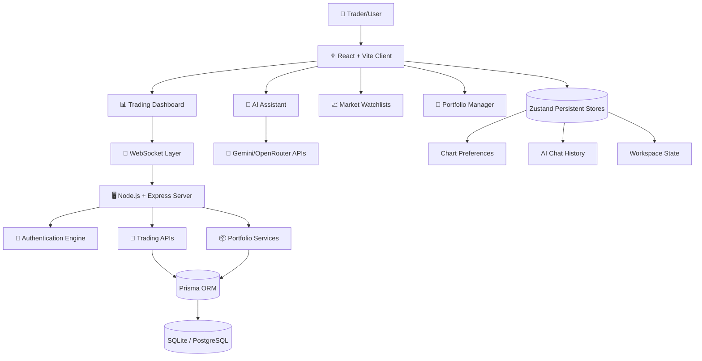
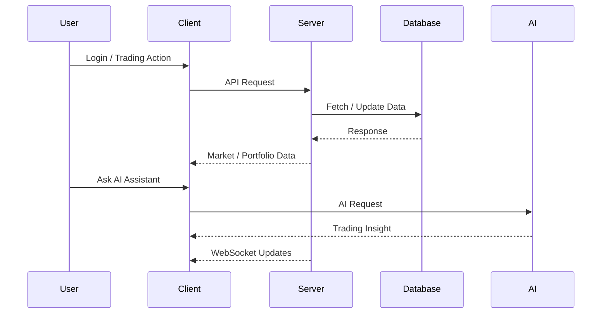
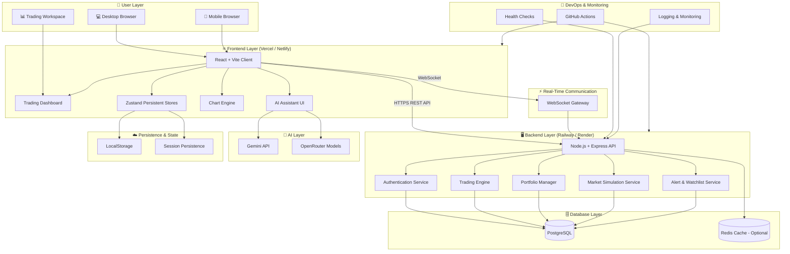
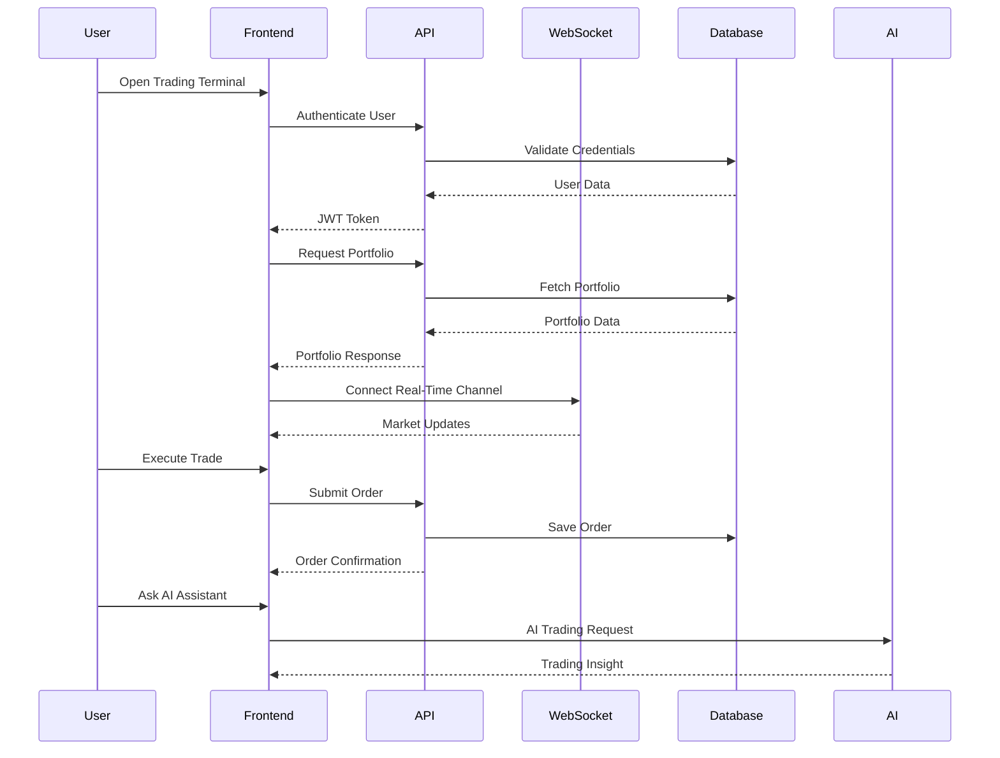
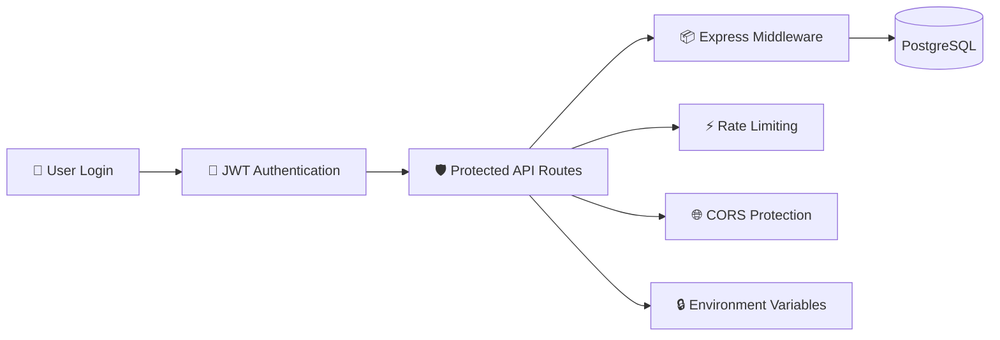
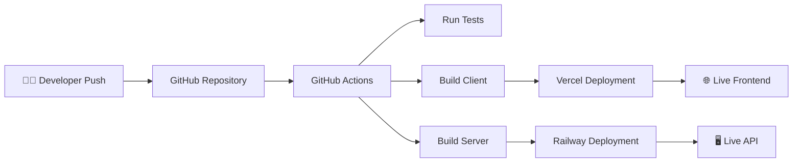

<div align="center">

# 📈 TerminalAlpha

### AI-Powered Trading Terminal & Market Intelligence Platform


<br/>
<br/>


</div>

---

# ✨ Overview

**TerminalAlpha** is a modern AI-enhanced trading terminal designed for traders, analysts, and fintech enthusiasts.

It combines:
- 📊 Advanced financial charting
- 🤖 AI-assisted trading insights
- ⚡ Real-time market simulation
- 💼 Portfolio & order management
- 🌐 WebSocket-powered live updates
- 🧠 Persistent intelligent workspaces

The platform delivers a sleek institutional-grade experience inspired by modern trading terminals.

---

# 🚀 Core Features

## 📊 Advanced Trading Dashboard
- Interactive market charts
- Technical indicators
- Responsive trading workspace
- Real-time updates

## 🤖 AI Trading Assistant
- Gemini AI integration
- OpenRouter AI support
- Context-aware market conversations
- Persistent chat history

## 💼 Portfolio Management
- Create and manage portfolios
- Simulated trading system
- Pending orders
- Market order execution

## 📈 Market Intelligence
- Watchlists
- Alerts system
- Trading panels
- Simulated market news

## ⚡ Real-Time Architecture
- WebSocket communication
- Live workspace synchronization
- Persistent chart settings

## 🌙 Premium UI/UX
- Modern fintech-inspired interface
- Responsive layouts
- Lazy-loaded modules
- Smooth animations

---

# 🧠 System Architecture



---

# ⚡ System Workflow



---

# 🏗️ Tech Stack

| Technology | Purpose |
|---|---|
| React 19 | Frontend UI |
| TypeScript | Type Safety |
| Vite | Build Tool |
| Node.js | Backend Runtime |
| Express.js | API Layer |
| Prisma ORM | Database ORM |
| SQLite / PostgreSQL | Database |
| Zustand | State Management |
| WebSockets | Real-Time Updates |
| Gemini AI | AI Assistant |
| OpenRouter | AI Models |
| Tailwind / CSS | Styling |

---

# 📂 Project Structure

```bash
TerminalAlpha/
│
├── client/
│   ├── public/
│   │
│   ├── src/
│   │   ├── components/
│   │   ├── pages/
│   │   ├── layouts/
│   │   ├── hooks/
│   │   ├── services/
│   │   ├── stores/
│   │   ├── utils/
│   │   ├── routes/
│   │   └── styles/
│   │
│   ├── package.json
│   └── vite.config.ts
│
├── server/
│   ├── prisma/
│   ├── src/
│   │   ├── routes/
│   │   ├── controllers/
│   │   ├── middleware/
│   │   ├── services/
│   │   ├── websocket/
│   │   └── utils/
│   │
│   ├── package.json
│   └── tsconfig.json
│
├── README.md
└── package.json
```

---

# 📦 Deployment Architecture



---

# 🌐 Production Deployment Flow



---

# ☁️ Recommended Hosting Architecture

| Layer | Recommended Platform |
|---|---|
| Frontend | Vercel / Netlify |
| Backend API | Railway / Render |
| Database | Neon PostgreSQL / Supabase |
| WebSockets | Railway Persistent Services |
| AI Providers | Gemini + OpenRouter |
| CI/CD | GitHub Actions |
| Monitoring | UptimeRobot + Railway Metrics |

---

# 🔐 Security Architecture



---

# 🚀 CI/CD Pipeline



---

# 🔐 Environment Variables

## 🌐 Client

```env
VITE_API_URL="https://your-api.example.com/api"
VITE_WS_URL="wss://your-api.example.com"
VITE_GEMINI_API_KEY=""
VITE_OPENROUTER_API_KEY=""
```

---

## 🖥️ Server

```env
DATABASE_URL="file:./dev.db"
JWT_SECRET="use-a-long-random-production-secret"
JWT_EXPIRES_IN="7d"
PORT=3001
NODE_ENV="production"
CORS_ORIGIN="https://your-client.example.com"
```

---
# 🚀 Server Setup Guide

## 📁 Required Folder Structure

```bash
server/
│
├── prisma/
│   └── schema.prisma
│
├── src/
│
├── .env
│
├── package.json
│
└── dev.db
```

---

### ⚙️ Step 1 — Create `.env`

Inside the `server` folder create:

```bash
.env
```

Add:

```env
DATABASE_URL="file:./dev.db"

JWT_SECRET="supersecretkey123"
```

---

### 🛠️ Step 2 — Generate Prisma Client

```bash
npx prisma generate
```

---

### 🗄️ Step 3 — Create & Sync Database

```bash
npx prisma db push
```

---

### 📦 Step 4 — Install Dependencies

```bash
npm install
```
---

# ▶️ Step 5 — Start Server

```bash
npm run dev
```

---

# ✅ Expected Output

```bash
🚀 Paper Trading Server is running on port 3001
👉 CORS Origin allowed: http://localhost:5173
```

---

# 🔄 Full Startup Commands

```bash
npx prisma generate

npx prisma db push

npm install

npm run dev
```

---

## ❗ If bcrypt Error Occurs

Install bcrypt packages:

```bash
npm install bcryptjs

npm install -D @types/bcryptjs
```

---

## 🌐 Frontend API URL

Inside `client/.env`:

```env
VITE_API_URL="http://localhost:3001/api"
```

---

## 🧪 Verify Backend

Open:

```bash
http://localhost:3001
```

If you see:

```bash
Cannot GET /
```
the backend is running correctly.

---

# 🛠️ Installation

## Clone Repository

```bash
git clone https://github.com/LoganthP/TerminalAlpha.git
```

---

## Install Client

```bash
cd client
npm install
```

---

## Install Server

```bash
cd ../server
npm install
```

---

# ▶️ Run Development Environment

## Start Client

```bash
cd client
npm run dev
```

---

## Start Server

```bash
cd server
npm run dev
```

---

# 🚀 Production Build

## Build Client

```bash
cd client
npm run build
```

---

## Build Server

```bash
cd server
npm run build
npm run start
```

---

# 📊 Trading Features

| Feature | Status |
|---|---|
| Portfolio Management | ✅ |
| Market Orders | ✅ |
| Pending Orders | ✅ |
| AI Assistant | ✅ |
| Chart Persistence | ✅ |
| WebSocket Updates | ✅ |
| Watchlists | ✅ |
| Alerts | ✅ |
| Responsive UI | ✅ |
| Lazy Loading | ✅ |

---

# 🤖 AI Integration

## Supported AI Providers

- Gemini API
- OpenRouter Models

### AI Features
- Trading conversations
- Market explanations
- Strategy discussions
- Persistent AI history

---

# 🔥 Performance Optimizations

- ⚡ Route-level lazy loading
- ⚡ Vite manual chunk splitting
- ⚡ Zustand persistence
- ⚡ Optimized production builds
- ⚡ WebSocket live updates

---

# 📈 Production Readiness

## ✅ Validated

- TypeScript strict mode enabled
- Production builds passing
- Secure environment handling
- Persistent state architecture
- Lazy-loaded routing
- Optimized bundle splitting

## ⚠️ Follow-Up Work

- Replace simulated data with real providers
- Improve ESLint compliance
- Add provider-specific deployment configs
- Institutional-grade QA testing

---

# 🧪 Deployment Checklist

```bash
cd client
npm run build

cd ../server
npm run build
```

---

# ✅ Smoke Tests

- Authentication flow
- Dashboard rendering
- Trading operations
- Portfolio reset
- AI assistant responses
- Responsive layouts
- WebSocket updates

---

# 🌟 Future Roadmap

- 📡 Real market data integration
- 🏦 Brokerage connectivity
- 📊 Institutional analytics
- 🤖 Advanced AI trading agents
- ☁️ Cloud workspace sync
- 📱 Mobile application
- 🔔 Real push notifications

---

# 🤝 Contributing

Contributions are welcome!

```bash
Fork → Clone → Create Branch → Commit → Push → Pull Request
```

---

# 📜 License

This project is licensed under the MIT License.
